<h1 align="center">Go Micro Commerce</h1>

 

This application is primarily intended for exploring technical concepts. My goal is to experiment with different technologies, software architecture designs, and all the essential components involved in building distributed systems in Golang.

## Features :sparkles:

- Event-driven architecture using `Kafka` for event streaming, `Redis Pub/Sub` for message broadcasting, and `Asynq` for distributed task queues
- Each service implemented with Domain-Driven Design and Hexagonal architecture
- Custom saga workflow with saga states stored in `Postgres` and managed service using `Temporal`
- Use RS256 as the asymmetric JWT algorithm for microservices authentication
- `GraphQL Federation` for API specification and type-safety between client and server
- Synchronous `gRPC` for internal service-to-service communication
- Database migrations using `golang-migrate`
- Input validation with `go-playground/validator`
- CI/CD pipeline using `GitHub Actions`

## Technologies - Libraries 🛠️

- **[labstack/echo](https://github.com/labstack/echo)** - high performance, minimalist go web framework
- **[connectrpc/connect-go](https://github.com/connectrpc/connect-go)** - protobuf RPC
- **[99designs/glqgen](https://github.com/99designs/gqlgen)** - go generate based graphql server library
- **[jackc/pgx/v5](https://github.com/jackc/pgx)** - postgres driver and toolkit for Go
- **[ibm/sarama](https://github.com/IBM/sarama)** - go library for Apache Kafka.
- **[redis/go-redis](https://github.com/redis/go-redis)** - redis go client
- **[bsm/redislock](https://github.com/bsm/redislock)** - distributed locking implementation using Redis
- **[hibiken/asynq](https://github.com/hibiken/asynq)** - simple, reliable, and efficient distributed task queue in Go
- **[stretchr/testify](https://github.com/stretchr/testify)** - testing toolkit
- **[testcontainers/testcontainers-go](https://github.com/testcontainers/testcontainers-go)** - testcontainers for go
- **[spf13/viper](https://github.com/spf13/viper)** - go configuration with fangs
- **[spf13/cobra](https://github.com/spf13/cobra)** - a commander for modern go CLI interactions
- **[hashicorp/consul](https://github.com/hashicorp/consul)** - service discovery
- **[docker](https://www.docker.com/)** - container platform
- **[go-playground/validator/v10](https://github.com/go-playground/validator)** - go struct and field validation
- **[golang/crypto](https://github.com/golang/crypto)** - cryptographic functions
- **[golang-jwt/jwt/v5](https://github.com/golang-jwt/jwt)** - go implementation of JWT
- **[gorilla/websocket](https://github.com/gorilla/websocket)** - websocket implementation for go
- **[temporal](https://github.com/temporalio/temporal)** - workflow service

## Architecture Overview 🏗️

### 1. Auth Service

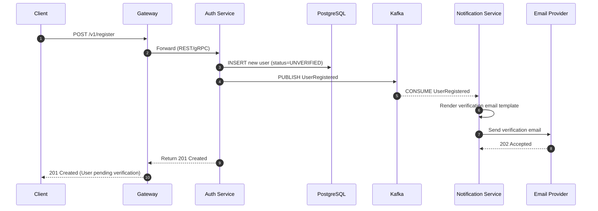

**Responsibilities**:

- User lifecycle management and service-to-service authentication
- Secure session and token handling
- Entities: `users`, `sessions`, `addresses`

**Key features**:

- JWT-based authentication with RS256 (asymmetric) algorithm, short-lived access + long-lived refresh tokens
- User verification via email with time-limited token (24h)
- Resend capability

### 2. Product Service

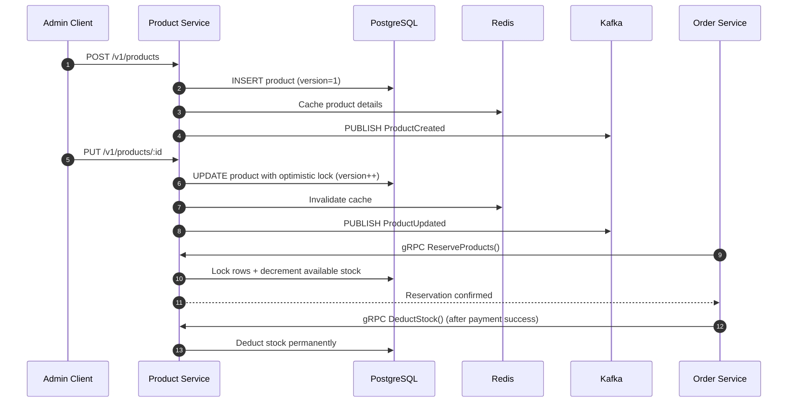

**Responsibilities**:

- Full product lifecycle management
- Inventory reservation and deduction with concurrency control
- Entities: `products`

**Key features**:

- Optimistic locking using a `version` column to prevent lost updates
- Stock reservation during order placement (via `gRPC`)
- Stock deduction only after payment confirmation (idempotent)
- Event publishing via `outbox pattern`
- Cache-aside pattern with `Redis` for high-read performance

### 3. Order Service

**Order Overview**:

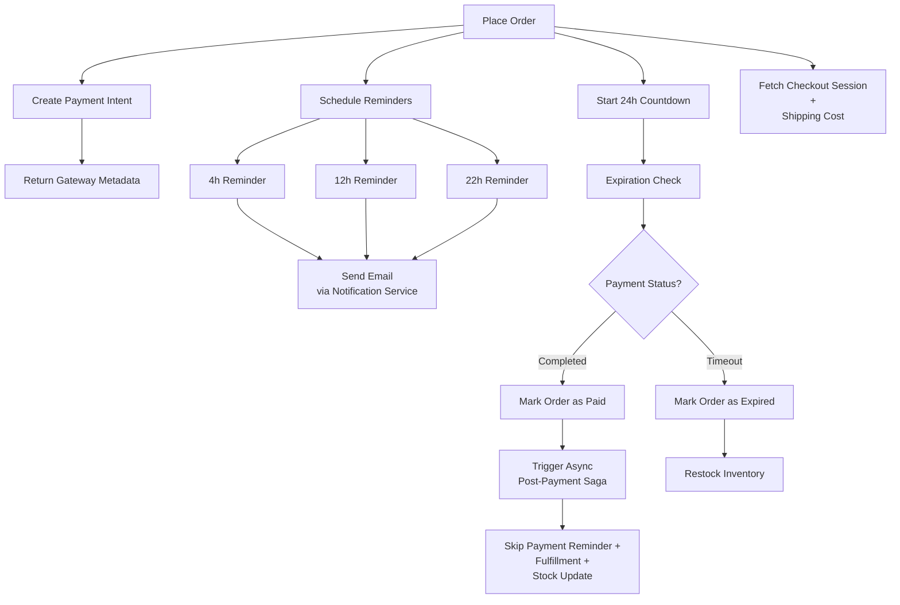

**Order Placement Flow**:

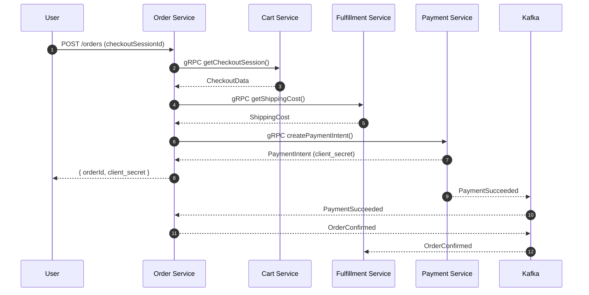

**Payment Reminder Flow**:

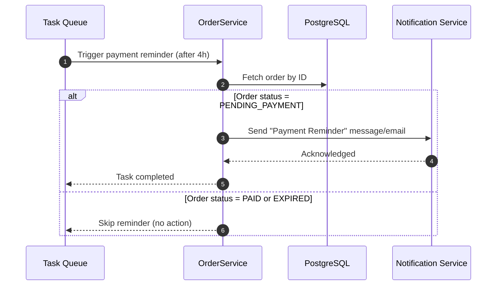

**Order Expiration Flow**:

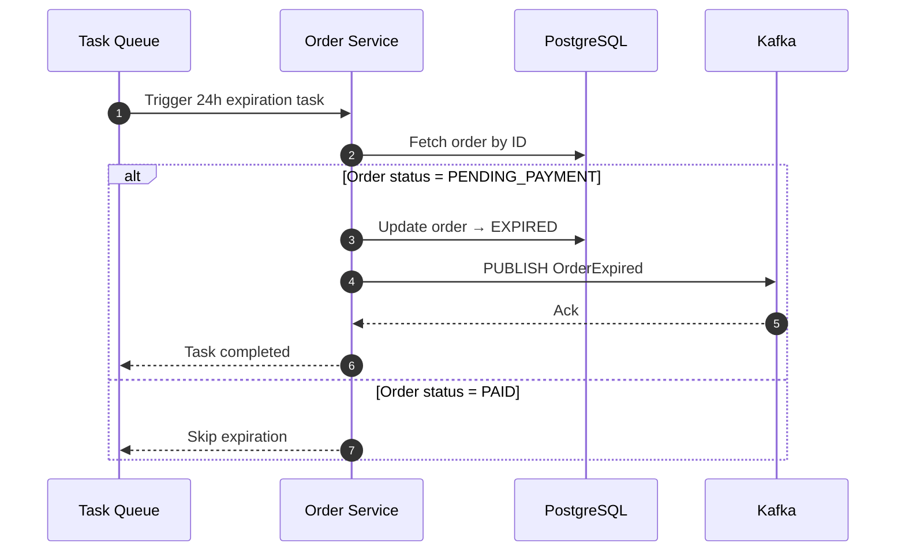

**Responsibilities**:

- Orchestrate the order creation
- Entities: `orders`, `order_items`, `inbox_events`, `outbox_events`, `saga_states`

**Key features**:

- Distributed locking for idempotency with Redis
-

### 4. Fulfillment Service

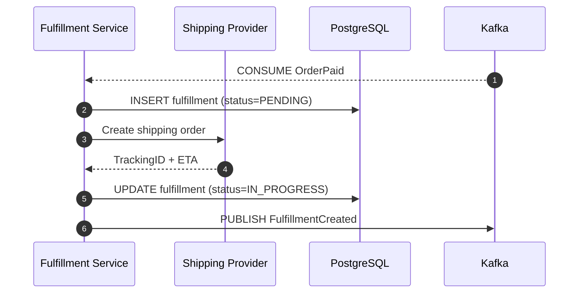

**Responsibilities**:

- Delivery service
- Shipping cost processing

**Key features**:

### 5. Payment Service

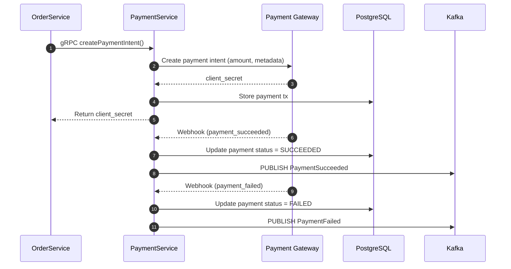

**Responsibilities**:

- Payment processing

**Key features**:

- Stripe, Xendit, etc (Factory)

### 6. Notification Service

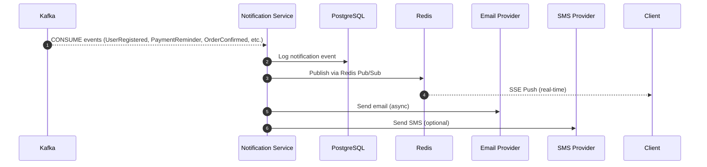

**Responsibilities**:

- Async notification processing

**Key features**:

- Push notification with SSE
- Async email processing
- SMS notification

### 7. Chat Service

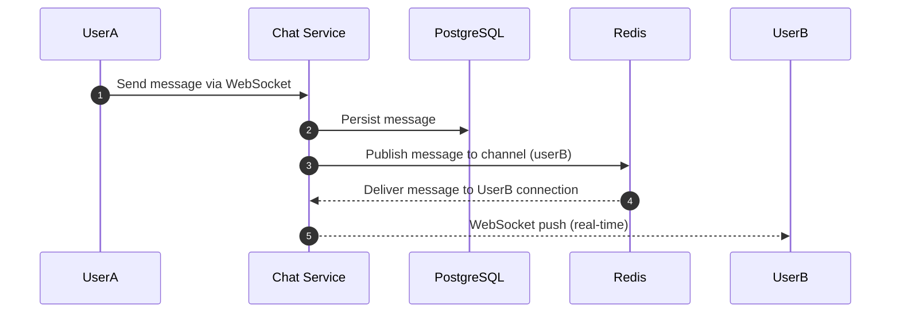

**Responsibilities**:

- Live chat implementation

**Key features**:

- with WebSocket

### 8. Cart Service

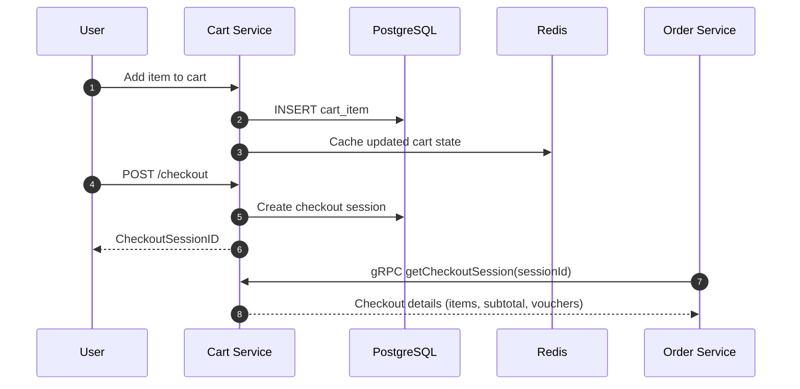

**Responsibilities**:

- Cart persistence
- Checkout Session

**Key features**:

### 9. Search Service

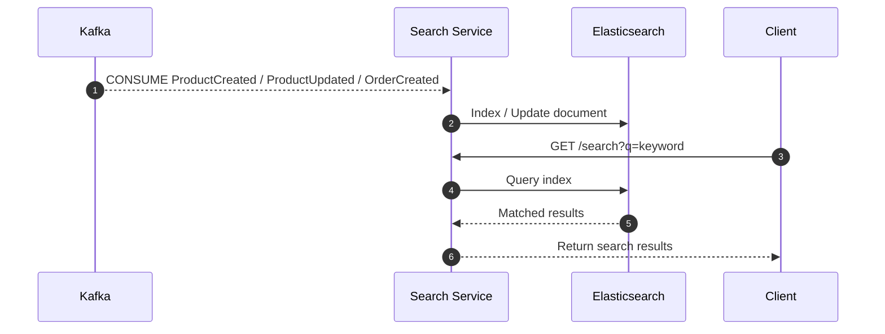

**Responsibilities**:

- Full text search

**Key features**:

- Elasticsearch

### 10. API Gateway

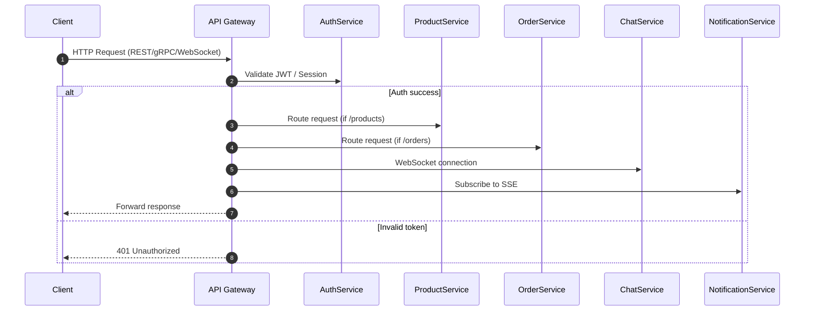

**Responsibilities**: Unified entry point, auth, rate limiting, service discovery, protocol routing (REST/gRPC/WebSocket/SSE)

**Key features**:

- JWT validation middleware
- Rate limiting

### 11. GraphQL Gateway

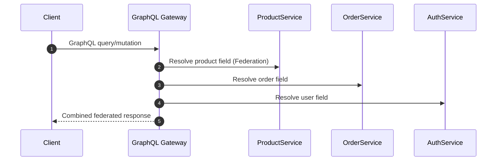

**Responsibilities**:

- Unified graphql

**Key features**:

- graphql federation

### 12. Observability

**Responsibilities**:

**Key features**:

- `Prometheus` - Real-time metrics for each service
- `Tempo` - End-to-end distributed tracing across services
- `Loki` - Centralized logging with structured labels
- `Grafana` - Performance dashboards for each service

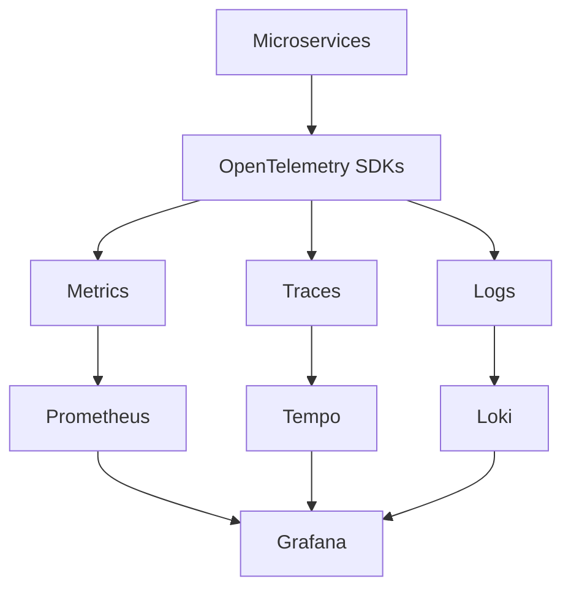

### 13. Frontend

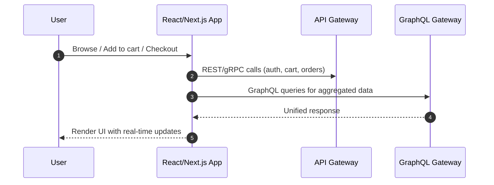
