<h1 align="center">Go Micro Commerce</h1>

 

This application is primarily intended for exploring technical concepts. My goal is to experiment with different technologies, software architecture designs, and all the essential components involved in building distributed systems in Golang.

## Features :sparkles:

- `Event-driven architecture` using `Kafka` for event streaming, `Redis PubSub` for message broadcasting, and `Asynq` for distributed task queues
- `Clean Architecture` (entity, repository, service, handler) with `Domain-Driven Design (DDD)` principles across all services
- Each microservice have own its dedicated `Postgres` database instance.
- 3-node `Kafka Cluster` running on `KRaft mode` (ZooKeeper-free)
- 6-node `Redis Cluster` (3 masters + 3 replicas)
- Central instrumentation using `OpenTelemetry` combined with LGTM stack (`Loki, Grafana, Tempo, Prometheus`)
- `Docker Compose` for local development and service orchestration
- `Traefik` as ingress controller / entry point from the outside wold into cluster
- `API Gateway` as application-level gateway, manages internal API requests.
- CI pipeline using `GitHub Actions` to automate build, test, and push images to a registry
- `Kubernetes` for robust, scalable container orchestration in production environments
- `GitOps-based deployments` for K8s apps using `Argo CD`
- Secure authentication implemented via `JWT` with `RS256` asymmetric algorithm and refresh token rotation
- Unified APIs with `GraphQL Federation` for type-safe client-server communication
- Internal communication via synchronous `gRPC calls` for microservices to interact with each other.
- Database Management with schema migrations handled by `golang-migrate`
- Validation using `go-playground/validator` for input sanitization
- Order creation with dual saga orchestration options between `custom saga` implementation (Postgres-based) or managed workflow service using `Temporal`
- Implemented `message inbox pattern` for idempotent event consumption and `transactional outbox pattern` for publishing domain events
- `Server-Sent Events (SSE)` for real-time push notification delivery in the notification-service.
- `WebSocket` support in the chat-service for bi-directional communication.
- Use [bytedance/sonic](https://github.com/bytedance/sonic) instead of standard go library for serde, it offers up to 5x faster unmarshalling and significant marshaling improvements, as demonstrated in this [benchmark](https://github.com/centralci/go-benchmarks/tree/b647c45272c7dc371fd4337cb3b6546356d967d1/json)

## Technology Stack 🛠️

- **[labstack/echo](https://github.com/labstack/echo)** - high performance, minimalist go web framework
- **[jackc/pgx/v5](https://github.com/jackc/pgx)** - postgres driver and toolkit for Go
- **[ibm/sarama](https://github.com/IBM/sarama)** - go library for Apache Kafka
- **[redis/go-redis](https://github.com/redis/go-redis)** - redis go client for cache and Pub/Sub
- **[bsm/redislock](https://github.com/bsm/redislock)** - distributed locking implementation using Redis
- **[elastic/go-elasticsearch](https://github.com/elastic/go-elasticsearch)** - official go client for elasticsearch
- **[hibiken/asynq](https://github.com/hibiken/asynq)** - simple, reliable, and efficient distributed task queue in Go using Redis
- **[google.golang.org/protobuf](https://github.com/protocolbuffers/protobuf-go)** - profobuf for go
- **[connectrpc/connect-go](https://github.com/connectrpc/connect-go)** - protobuf RPC framework
- **[bufbuild/buf](https://github.com/bufbuild/buf)** - linter, formatter, generator for protobuf
- **[99designs/glqgen](https://github.com/99designs/gqlgen)** - go generate based graphql server library
- **[bytedance/sonic](https://github.com/bytedance/sonic)** - a blazingly fast JSON serializing & deserializing library
- **[stretchr/testify](https://github.com/stretchr/testify)** - testing toolkit
- **[testcontainers/testcontainers-go](https://github.com/testcontainers/testcontainers-go)** - testcontainers for go
- **[spf13/viper](https://github.com/spf13/viper)** - go configuration with fangs
- **[spf13/cobra](https://github.com/spf13/cobra)** - a commander for modern go CLI interactions
- **[hashicorp/consul](https://github.com/hashicorp/consul)** - service registration and discovery
- **[docker](https://www.docker.com/)** - container platform
- **[go-playground/validator/v10](https://github.com/go-playground/validator)** - go struct and field validation
- **[golang/crypto](https://github.com/golang/crypto)** - cryptographic functions
- **[golang-jwt/jwt/v5](https://github.com/golang-jwt/jwt)** - go implementation of JWT
- **[gorilla/websocket](https://github.com/gorilla/websocket)** - websocket implementation for go
- **[temporal](https://github.com/temporalio/temporal)** - workflow engine service
- **[sony/gobreaker](https://github.com/sony/gobreaker)** - circuit breaker implemented in go
- **[prometheus/client_golang](https://github.com/prometheus/client_golang)** - prometheus instrumentation lib for go apps
- **[opentelemetry-go](https://github.com/open-telemetry/opentelemetry-go)** - opentelemetry go API and SDK
- **[shopspring/decimal](https://github.com/shopspring/decimal)** - precision fixed-point decimal numbers in go
- **[google/uuid](https://github.com/google/uuid)** - go package for UUIDs

## Architecture Overview 🏗️

The system follows a microservices architecture where each service represents an independent business domain. Services communicate through a combination of synchronous gRPC calls and asynchronous event-driven patterns. Data consistency across distributed transactions is ensured through Saga patterns, with support for both custom implementations and `Temporal`-managed workflows.

### 1. Authentication Service

Handles user identity, authentication, and session management with secure token-based authentication.

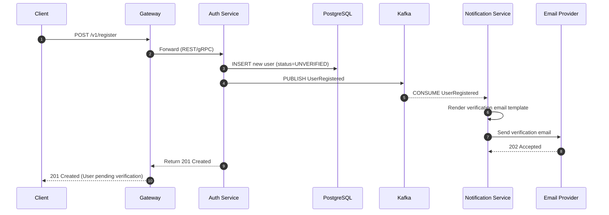

**Responsibilities**:

- User lifecycle management (registration, verification, profile updates)
- Service-to-service authentication and authorization
- Secure session and token management

**Entities**: `users`, `sessions`, `addresses`

**Key Features**:

- JWT-based authentication with RS256 asymmetric algorithm
- Short-lived access tokens (15-30 minutes) and long-lived refresh tokens (7-30 days)
- Email verification with time-limited tokens (24-hour expiry)
- Resend verification capability with rate limiting

### 2. Product Service

Manages product catalog, inventory, and pricing.

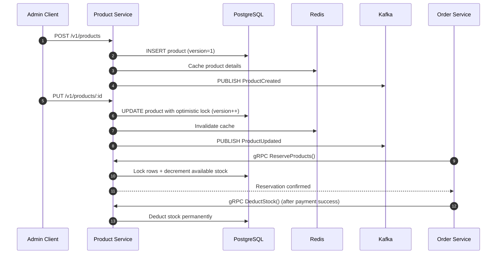

**Responsibilities**:

- Full product lifecycle management (CRUD operations)
- Inventory reservation and deduction with concurrency control
- Price management and versioning

**Entities**: `products`, `outbox_events`

**Key Features**:

- Optimistic locking using version column to prevent lost updates
- Stock reservation during order placement (via gRPC)
- Idempotent stock deduction after payment confirmation
- Cache-aside pattern with Redis for high-read performance

### 3. Order Service

Orchestrates complex order workflows using hybrid synchronous and asynchronous communication patterns.

**Order Lifecycle Overview**:

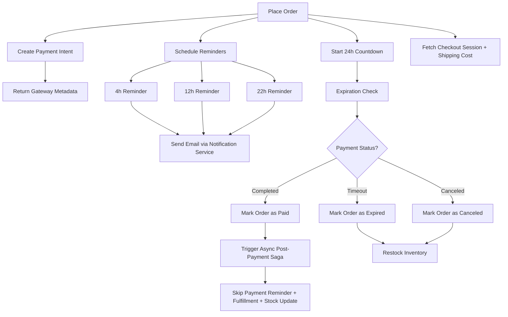

**Order Placement Flow**:

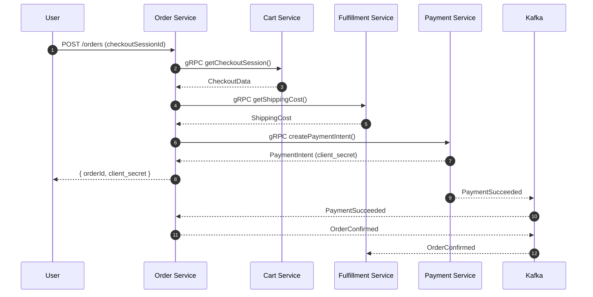

**Payment Reminder Flow**:

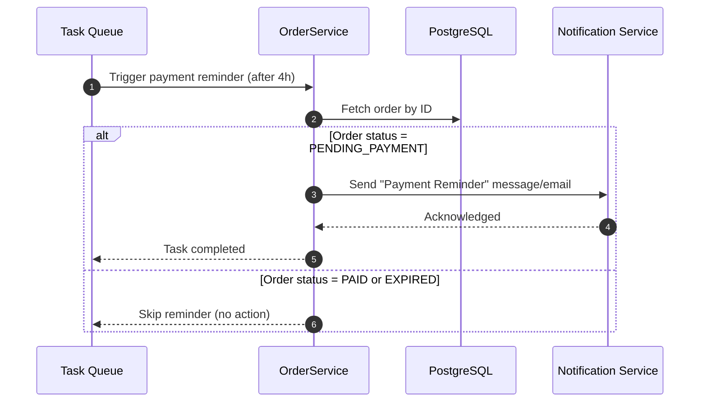

**Order Expiration Flow**:

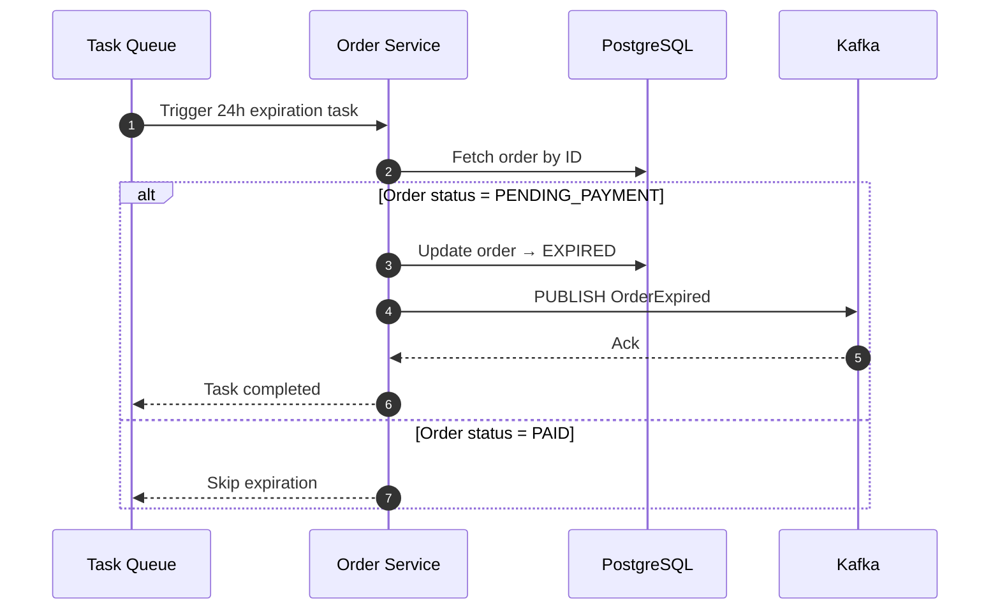

**Responsibilities**:

- Order lifecycle orchestration and state management
- Coordination between cart, payment, and fulfillment services
- Saga pattern implementation for distributed transactions

**Entities**: `orders`, `order_items`, `inbox_events`, `outbox_events`, `saga_states`

**Key Features**:

- Distributed locking with Redis for operation idempotency
- Dual saga implementation (custom `Postgres`-based and `Tempora`l-managed)
- Automated payment reminders and order expiration
- Support for order modifications and cancellations

### 4. Fulfillment Service

Manages order fulfillment, shipping, and delivery tracking.

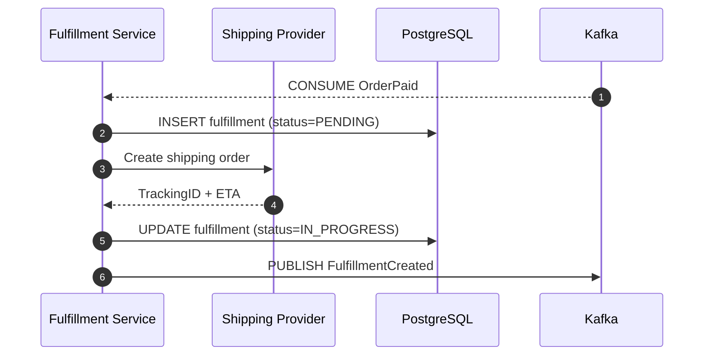

**Responsibilities**:

- Delivery and shipping management
- Shipping cost calculation and processing

**Entities**: `fulfillments`

### 5. Payment Service

Handles payment processing with multiple gateway integrations.

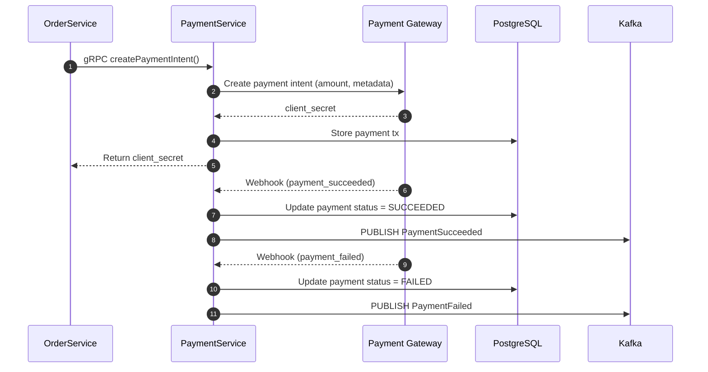

**Responsibilities**:

- Payment processing and transaction management
- Multiple payment gateway integrations
- Webhook handling for payment status updates
- Refund and dispute management

**Entities**: `payments`, `outbox_events`, `inbox_events`

**Key Features**:

- Payment gateway factory pattern supporting Stripe and other gateways.
- Idempotent payment processing with idempotency keys
- Secure webhook verification and handling
- Comprehensive payment analytics and reporting

### 6. Notification Service

Processes and delivers notifications across multiple channels.

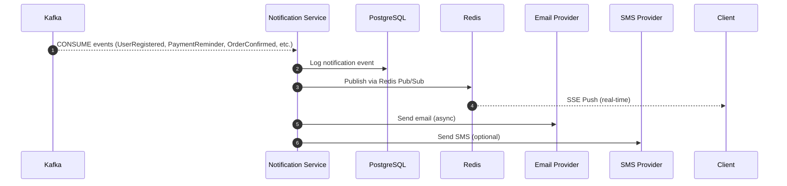

**Responsibilities**:

- Asynchronous notification processing and delivery
- Multi-channel notification support (email, SMS, push)
- Notification template management

**Entities**: `notifications`, `inbox_events`

**Key Features**:

- Real-time push notifications with Server-Sent Events (SSE)
- Async email processing
- SMS notification support with failover providers

### 7. Chat Service

Provides real-time customer support and communication capabilities.

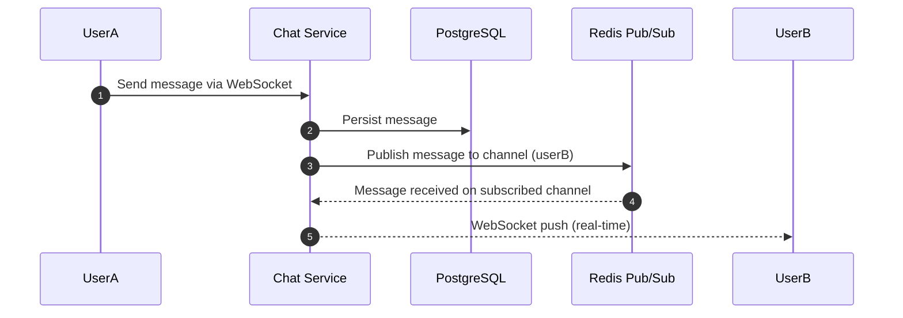

**Responsibilities**:

- Live chat implementation for customer support
- Real-time message delivery and persistence
- Chat room management and moderation
- File sharing and rich media support

**Entities**: `conversations`, `messages`, `participants`, `connections`

**Key Features**:

- WebSocket-based real-time communication
- Conversation history and search
- Typing indicators and online status
- Support for group chats and channels

### 8. Cart Service

Manages shopping cart functionality and checkout session preparation.

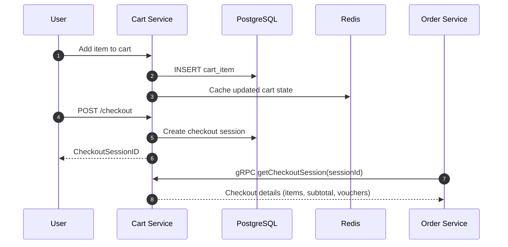

**Responsibilities**:

- Shopping cart lifecycle management
- Checkout session generation and validation
- Cart abandonment tracking and recovery
- Promotional code, payment gateway, and courier selection

**Entities**: `carts`, `cart_items`, `checkout_sessions`, `outbox_events`

**Key Features**:

- Cart synchronization and persistence
- Promotional code validation and application
- Cart expiration and cleanup

### 9. Search Service

Provides full-text search and advanced filtering capabilities.

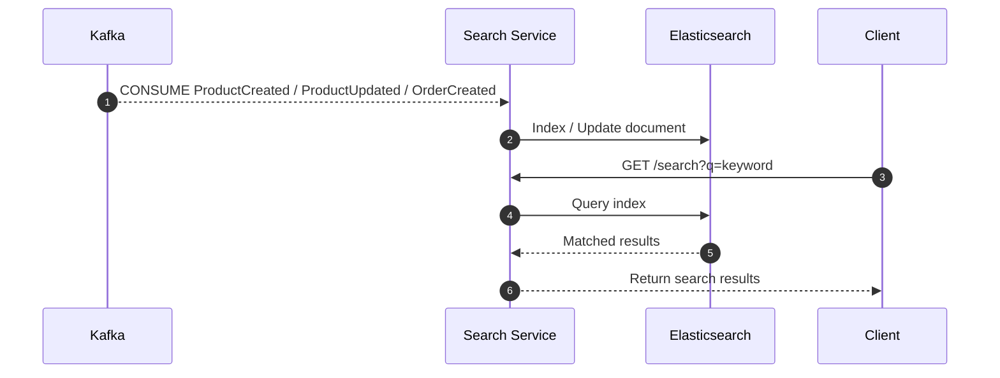

**Responsibilities**:

- Document indexing and search functionality

**Entities**: `inbox_events`

**Key Features**:

- Real-time indexing via Kafka events
- Advanced full-text search with fuzzy matching
- Faceted search with filters and aggregations
- Search relevance scoring and boosting
- Search analytics and popular queries

### 10. API Gateway

Serves as the unified entry point for all client requests with routing capabilities.

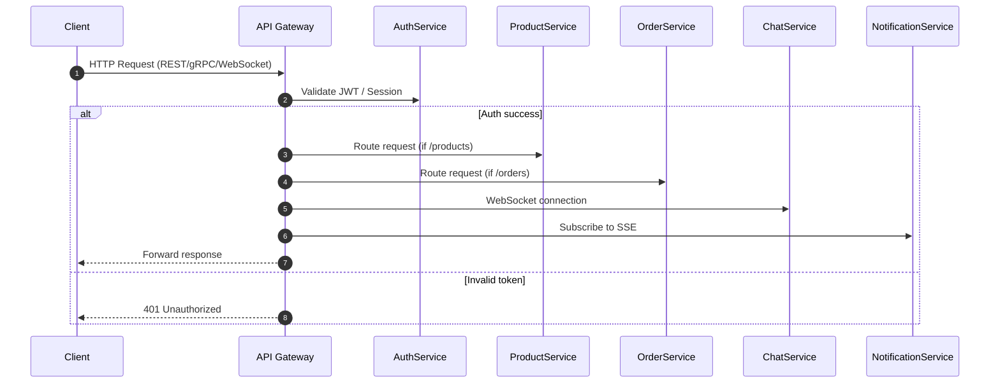

**Responsibilities**:

- Unified API entry point and request routing
- Authentication and authorization middleware
- Rate limiting and request throttling
- Protocol translation (REST/gRPC/WebSocket/SSE)
- Service discovery and load balancing

**Key Features**:

- JWT validation middleware
- Configurable rate limiting per endpoint and user
- Request/response transformation and validation
- Circuit breaker pattern for fault tolerance
- Comprehensive request logging and metrics
- CORS and security headers management

### 11. GraphQL Gateway

Provides a federated GraphQL interface for unified data querying.

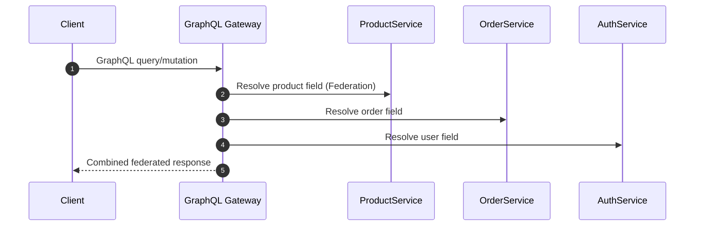

**Responsibilities**:

- Unified GraphQL schema federation
- Client-specific schema customization

**Key Features**:

- Apollo Federation for schema composition
- Custom JWT Authentication
- Real-time subscriptions support
- Schema validation and versioning

### 12. Observability Stack

Comprehensive monitoring, tracing, and logging for system visibility.

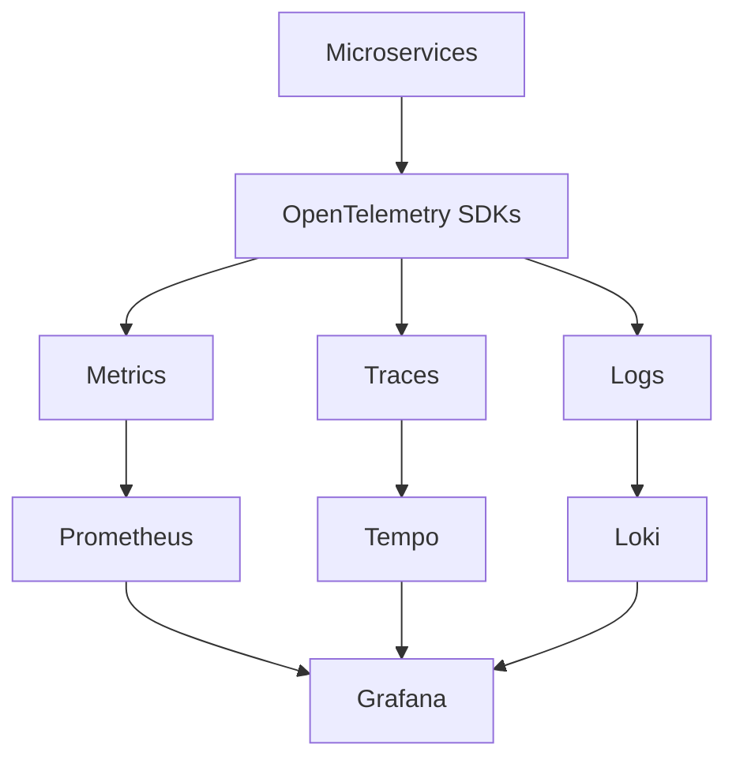

**Responsibilities**:

- System-wide monitoring and alerting
- Distributed tracing for request flow analysis
- Centralized logging and log aggregation
- Performance metrics collection and visualization

**Key Features**:

- **Prometheus** - Real-time metrics collection with service-level indicators
- **Tempo** - End-to-end distributed tracing across service boundaries
- **Loki** - Centralized logging with structured labels and efficient storage
- **Grafana** - Unified dashboards for metrics, traces, and logs correlation

### 13. Frontend Application

Modern React-based user interface with real-time capabilities.

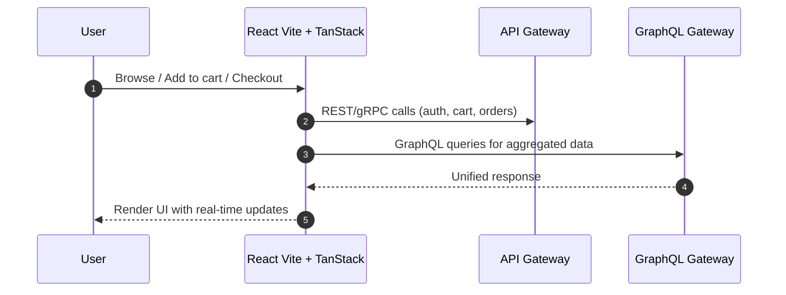

**Responsibilities**:

- User interface rendering and interaction handling
- State management and data synchronization
- Real-time updates via WebSocket and SSE

**Key Features**:

- Use Tanstack Query, Form, and Router
- TypeScript for type safety and developer experience
- Real-time updates for chat, notifications, and order status
- Performance optimization with code splitting and lazy loading
